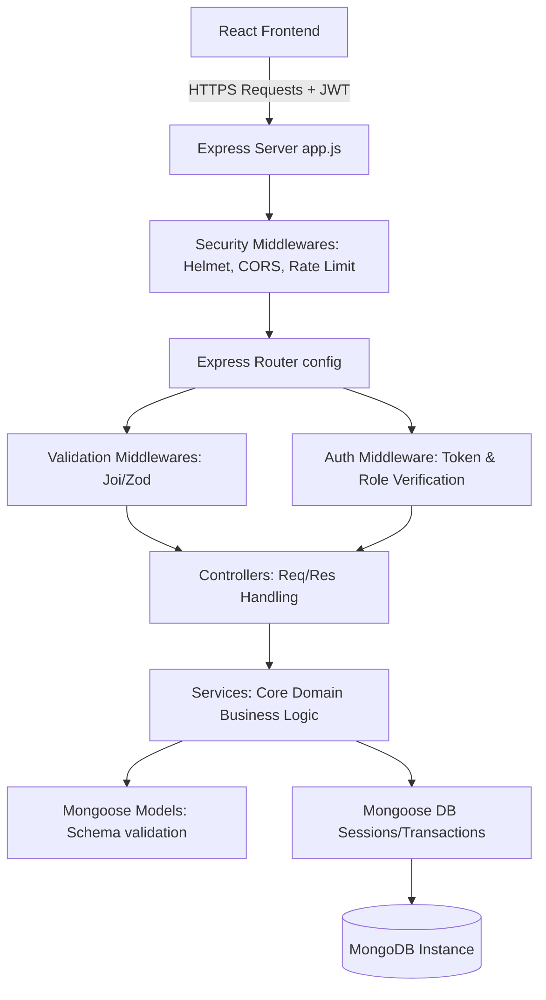

# Production-Ready MERN Banking Application

A highly scalable, secure, and production-ready architecture for a modern Banking Application built on the **MERN** stack (MongoDB, Express, React, Node.js). 

This project uses a decoupled monorepo-style structure, separating the frontend client (`client/`) and the backend API server (`server/`). It is designed to scale dynamically, isolate domain logic, and support advanced banking workflows such as transaction auditing and role-based access control.

---

## Technical Stack

- **Frontend:** React + Vite, Tailwind CSS (Styling), Redux Toolkit (State Management), React Router DOM v6 (Routing).
- **Backend:** Node.js, Express.js (REST API Server).
- **Database:** MongoDB, Mongoose ODM (Data modeling & transaction integrity).
- **Authentication:** JSON Web Tokens (JWT) stored securely + password hashing via `bcryptjs`.
- **Security & Validation:** Helmet, CORS, Express Rate Limiter, Joi / Zod (Data Validation).

---

## System Architecture Overview



### 1. Backend Architecture (`server/`)
The backend is structured around the **Separation of Concerns (SoC)** principle, moving database and calculations out of controllers and into services:

* **Entry Points:** `server.js` handles server clustering, port binding, and listener configuration. `src/app.js` handles middleware aggregation and router mounting.
* **Database Transactions:** The `services/bank.service.js` leverages MongoDB multi-document transactions (`session.startTransaction()`) to guarantee the ACID properties of ledger operations (e.g., deducting balance from Account A and adding to Account B must both succeed, or both fail).
* **Security Middleware:** Includes helmet headers, strict CORS, rate-limiting on authentication routes, and custom error middleware mapping database errors directly into clean client-friendly REST responses.
* **Role-Based Access Control (RBAC):** Token authentication extracts user state, and `role.middleware.js` blocks or permits paths based on role metadata (`USER`, `ADMIN`, `AUDITOR`).

### 2. Frontend Architecture (`client/`)
The frontend is constructed using a modern, performant React structure:

* **Build System:** Vite provides near-instantaneous hot module replacement (HMR) and optimized rollup-based builds.
* **State Management:** Redux Toolkit manages global data (e.g., authenticated user details, accounts, transaction history) to avoid prop-drilling, while local React state handles UI operations (toggles, forms, inputs).
* **Guarded Routing:** Routes inside `routes/AppRoutes.jsx` are wrapped in Guard Components (`ProtectedRoute`, `AdminRoute`, `PublicOnlyRoute`) that evaluate the redux auth state before rendering dashboard or administrative views.
* **Axios Interceptors:** An API configuration utility automatically appends authorization headers (`Bearer <token>`) to outbound requests and intercept responses to handle `401 Unauthorized` logouts dynamically.

---

## Directory Structures

### Client Structure (`/client`)
```
client/
├── src/
│   ├── api/          # Axios instance configurations and base interceptors
│   ├── assets/       # Images, logos, and fonts
│   ├── components/   # UI elements categorized by domain
│   │   ├── common/   # Reusable UI controls (Buttons, Inputs, Spinners)
│   │   ├── auth/     # Auth-specific widgets (Login forms, Register cards)
│   │   ├── dashboard/# Charts, stats cards, and activity feeds
│   │   ├── accounts/ # Account lists and cards
│   │   ├── transactions/ # Transaction tables and ledger items
│   │   └── admin/    # Management boards
│   ├── pages/        # Main landing pages (Dashboard, Admin, Login, etc.)
│   ├── layouts/      # Visual containers (AuthLayout, MainLayout, AdminLayout)
│   ├── routes/       # Route guards and router config
│   ├── hooks/        # Reusable React custom hooks (useAuth, useModal, useFetch)
│   ├── context/      # Context providers (e.g., theme toggle, alerts)
│   ├── redux/        # Redux Toolkit store and slices
│   ├── utils/        # Utilities (formatters, currency conversion)
│   ├── services/     # Direct network service calls
│   ├── App.jsx       # Component router wrapper
│   └── main.jsx      # Vite React DOM entrypoint
├── package.json      # Dependencies and scripts
├── vite.config.js    # Vite configurations
└── tailwind.config.js # Tailwind CSS configuration
```

### Server Structure (`/server`)
```
server/
├── src/
│   ├── config/       # Databases, services, and security initializations
│   ├── controllers/  # Request and response handlers
│   ├── models/       # Mongoose schemas and indexes
│   ├── routes/       # API endpoints definitions
│   ├── middlewares/  # Authentication, rate limiters, and error handling
│   ├── services/     # Core banking operations and domain business logic
│   ├── utils/        # Helper classes (ApiError, ApiResponse)
│   ├── validations/  # Joi / Zod input validation schemas
│   ├── seeders/      # Mock database seeds for testing
│   └── app.js        # Express app initializer
├── server.js         # Port listener and cluster manager
├── .env.example      # Example environment properties
└── package.json      # Dependencies and scripts
```

---

## Security Practices (Production Checklist)

1. **Helmet & Security Headers:** Integrated to protect the Express app from cross-site scripting (XSS), clickjacking, and mime-type sniffing.
2. **Strict Validation:** No payload directly accesses database layers. Joi / Zod schemas sanitize all inbound properties.
3. **Database Transactions:** Mongoose sessions ensure ledger consistency and avoid double-spending or balance mismatch states.
4. **JWT Verification:** Claims include expirations and are verified against a strong server-side signature. Tokens should be stored in secure cookies (`httpOnly`, `secure`, `sameSite: 'strict'`) in live environments.
5. **Environment Separation:** API keys, database credentials, and secrets are strictly housed in `.env` files and omitted from git history via `.gitignore`.
